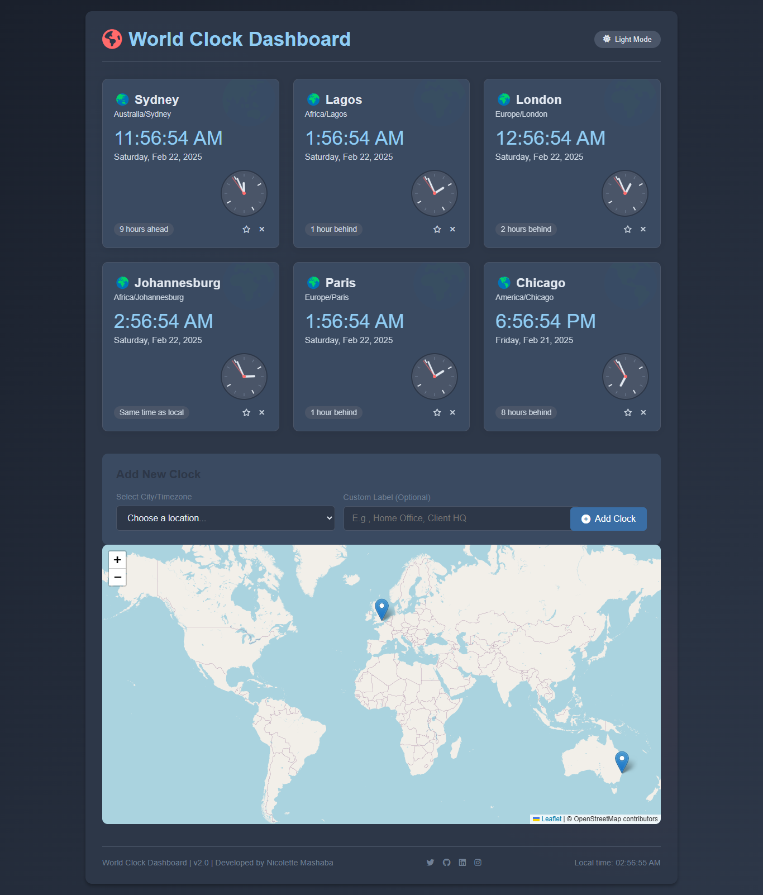

# 🌍 World Clock Application 🕒

A **World Clock Application** that displays the current time in multiple timezones, complete with an interactive world map, analog and digital clocks, and the ability to add or remove clocks. Built with **JavaScript**, **Leaflet.js** (for the interactive map), and **CSS** for styling.

## ✨ Features

* **Multiple Timezones**: Display clocks for cities like New York, London, Tokyo, and Sydney ⏰
* **Interactive World Map**: View the locations of the selected timezones on a realistic world map powered by **Leaflet.js** 🗺️
* **Analog and Digital Clocks**: Each clock shows both analog and digital time 🕰️
* **Add/Remove Clocks**: Easily add or remove clocks for different timezones ➕➖
* **Time Difference**: See how many hours ahead or behind each timezone is compared to your local time ⏱️
* **Dark/Light Mode**: Toggle between dark and light themes for better visibility 🌓

## 📸 Screenshots

*Main interface with clocks and world map.*

*Adding a new clock with the timezone selector.*

## 🚀 How to Use

1. **View Clocks**: The application displays clocks for predefined timezones (e.g., New York, London, Tokyo, Sydney).
2. **Add a Clock**:
   * Select a timezone from the dropdown menu.
   * Optionally, provide a custom name for the city.
   * Click "Add Clock" to add it to the display and map.
3. **Remove a Clock**: Click the "×" button on any clock to remove it.
4. **Toggle Theme**: Switch between dark and light modes using the theme toggle button.

## 🛠️ Setup Instructions

### Prerequisites

* A modern web browser (e.g., Chrome, Firefox, Edge) 🌐
* An internet connection (to load Leaflet.js and map tiles) 📡

### Steps

1. **Clone the Repository**:
```bash
git clone https://github.com/NickiMash17/world-clock-app.git
cd world-clock-app
```

2. **Open the Application**:
   * Open the `index.html` file in your browser.
3. **Run Locally**:
   * If you have a local server (e.g., `http-server` or `Live Server`), serve the project folder and open it in your browser.

## 💻 Technologies Used

* **HTML**: Structure of the application 📄
* **CSS**: Styling for clocks, map, and themes 🎨
* **JavaScript**: Core logic for clocks, time calculations, and interactivity ⚙️
* **Leaflet.js**: Interactive world map with markers for each timezone 🗺️
* **OpenStreetMap**: Tile layer for the world map 🌐

## 📁 Code Structure

* `index.html`: Main HTML file.
* `styles.css`: Styles for the application.
* `script.js`: JavaScript code for clocks, map, and interactivity.
* `images/`: Folder for map images or other assets.
* `screenshots/`: Folder for screenshots (optional).

## 🔧 Customization

* **Add More Timezones**:
   * Update the `timezoneCoordinates` object in `script.js` with new latitude and longitude values.
   * Add new options to the timezone dropdown in `index.html`.
* **Change Map Style**:
   * Replace the OpenStreetMap tile layer with a different one (e.g., Mapbox, Google Maps).
* **Add More Features**:
   * Add a search bar to find timezones.
   * Implement a favorites system for frequently used clocks.

## 📜 License

This project is licensed under the **MIT License**. See the LICENSE file for details.

## 👏 Acknowledgments

* **Leaflet.js**: For the interactive map functionality 🙌
* **OpenStreetMap**: For providing free map tiles 🌍
* **NASA's Blue Marble**: For the realistic world map image (optional) 🌎

## 📧 Contact

For questions or feedback, feel free to reach out:
* **nene171408@gmail.com**: Your Email 📩
* **NickiMash17**: Your GitHub Profile 👨‍💻

Enjoy using the **World Clock Application**! 🌍⏰🌏

\